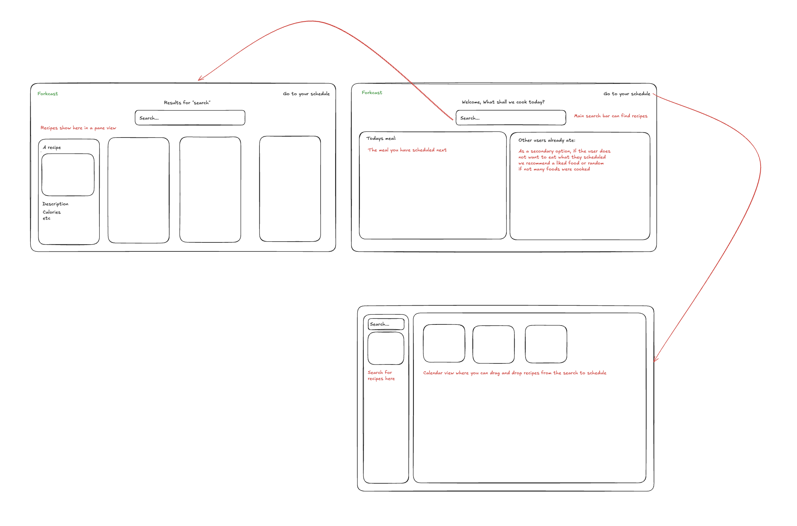

# Forkcast

Forkcast ist eine webbasierte Applikation, die den Prozess der Mahlzeitenplanung digitalisiert und vereinfacht. Anstatt mühsam Listen zu schreiben, kombiniert Forkcast einen Drag-and-Drop-Kalender mit einer
intelligenten Einkaufsliste.

## Kernfunktionen

### Intelligenter Kalender & Mahlzeiten-Planer

- Das Herzstück der App ist der interaktive Wochenkalender.
- Drag & Drop: Nutzer ziehen Rezepte einfach in einen Wochentag.
- Mahlzeiten-Kategorisierung: Beim Ablegen öffnet sich ein Pop-up zur Auswahl: Frühstück, Mittagessen, Abendessen oder
  ein
  freies Textfeld (z.B. für "Snack" oder "Geburtstagsfeier").
- Portions-Anpassung: Die Mengen der Zutaten werden im Planer individuell auf die Personenanzahl hochgerechnet.

### Smarte Einkaufsliste

- Smarte Zutaten: Gleiche Zutaten aus verschiedenen Rezepten (z.B. Zwiebeln) werden automatisch addiert.
- Bestands-Check: Nutzer können Zutaten, die sie bereits vorrätig haben, abhaken oder die Menge manuell reduzieren.
- Rechtzeitige Planung: Die Liste generiert sich automatisch aus dem Wochenplan, um sicherzustellen, dass alle Zutaten
  rechtzeitig im Haus sind.

### Social & Discovery Feed

- Die Homepage fungiert als Inspirationsquelle
- Freundes-Netzwerk: Über die Suche nach Usernamen können Freunde hinzugefügt werden.
- Rezept-Inspiration: Nutzer sehen vorgeschlagene Rezepte ihrer Freunde direkt auf der Startseite.
- Privacy-Settings: Jeder User entscheidet selbst, ob sein persönlicher Wochenplan Public (für Freunde sichtbar) oder
  Private ist.
- Heutiges Highlight: Das aktuelle Gericht des Tages wird angezeigt.

### Personalisierung & API-Integration

- Spoonacular API: Als Datenquelle liefert die API eine riesige Auswahl an Rezepten inklusive detaillierter Zutatenlisten
und Nährwerte.
- Allergie-Filter: In den User-Einstellungen hinterlegte Allergien werden bei allen Empfehlungen automatisch
berücksichtigt.

## Teammember

- Kerimcan Yagci, Lukas Grünzweil, Erik Reitbauer, Nico Haider

## Color palette

https://coolors.co/e8f1f2-b3efb2-7a9e7e-31493c-001a23

## DB - Entities

- User (id, name, email, password, profilePicture)
- Friend (userId, friendId)
- Notification (id, userId, type, content, isRead)
- CalenderEntry(userId, date, recipeId)
- Recipe(id, name, image)
- FavoriteFood(userId, recipeId)

