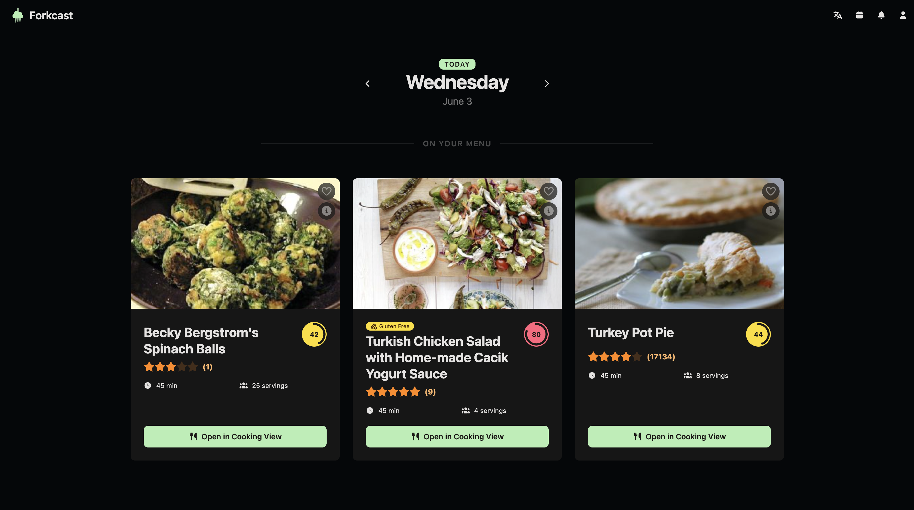
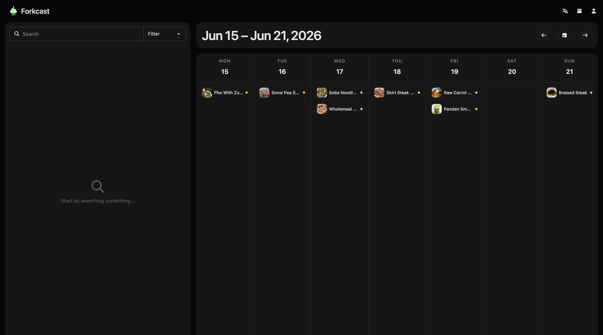
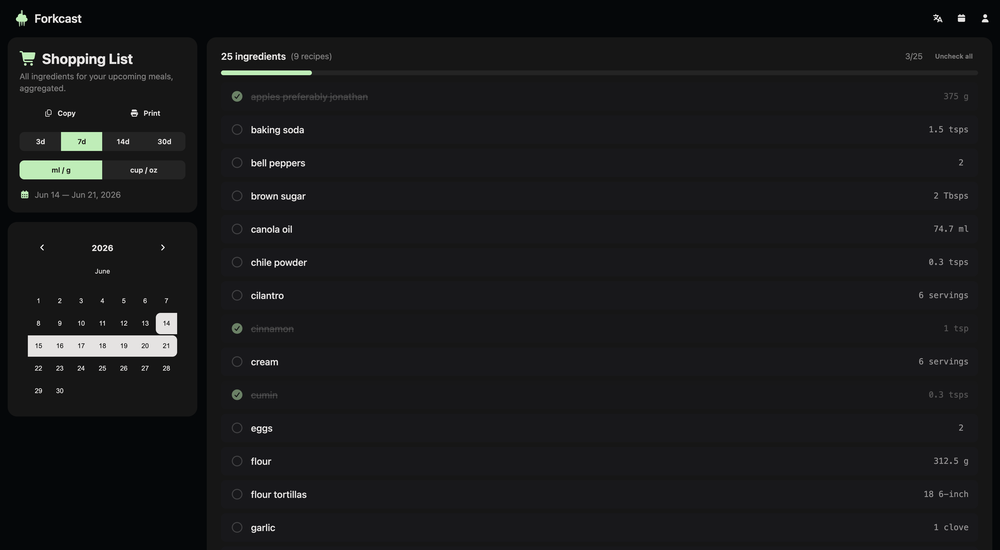
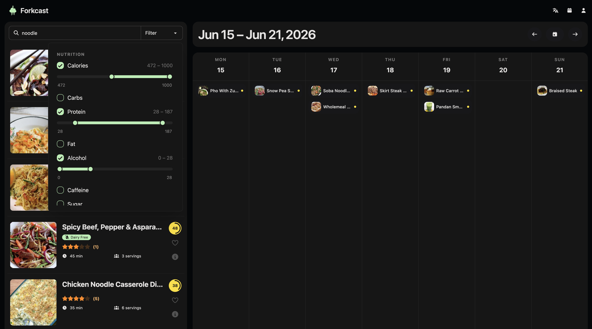
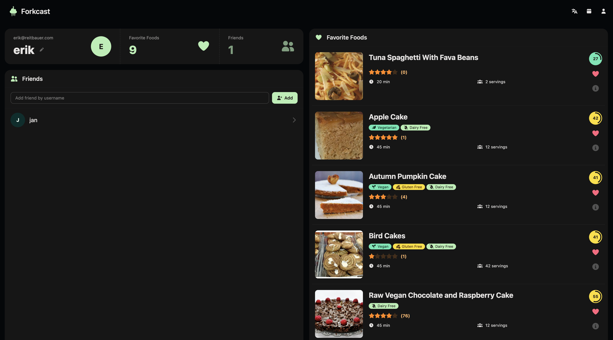
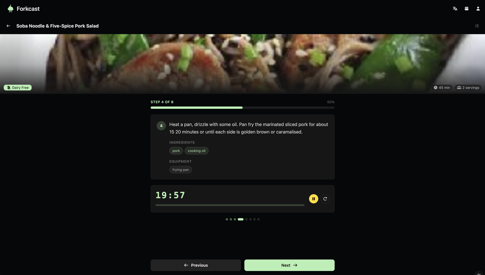

# Forkcast

Forkcast is a web application that digitizes and simplifies meal planning. Instead
of juggling paper lists, it combines a drag-and-drop weekly calendar with a smart
shopping list, recipe discovery, and a small social layer around friends.

## Demo

| Dashboard | Weekly Schedule | Shopping List |
|-----------|-----------------|---------------|
|  |  |  |

| Discovery | Friends | Cooking |
|-----------|---------|---------|
|  |  |  |

## Features

### Meal Planner & Calendar
- Interactive weekly calendar as the core of the app.
- Drag & drop recipes onto a weekday.
- Categorize each entry: breakfast, lunch, dinner, or a free-text label (e.g. "Snack").
- Portions scale ingredient amounts to the number of people.

### Smart Shopping List
- Generated automatically from the weekly plan.
- Identical ingredients across recipes (e.g. onions) are merged and summed.
- Stock check: tick off or reduce quantities for items already at home.

### Discovery & Social
- Home page acts as an inspiration feed with a daily highlight.
- Friend network: add friends by username, send/accept/decline requests.
- Privacy: each user chooses whether their weekly plan is public (visible to friends) or private.

### Recipes & Personalization
- Spoonacular API as recipe data source, with detailed ingredients and nutrition.
- Search with filters; favorites and per-recipe ratings.
- Allergy / dietary filters applied to recommendations.
- 9 UI languages incl. right-to-left (Arabic, Hebrew).

## Architecture

Monorepo with two independently deployed apps:

| Part | Stack | Deploy |
|------|-------|--------|
| [`frontend/`](frontend/README.md) | Nuxt 4 (Vue 3), Pinia, TailwindCSS 4 + DaisyUI, i18n | Static site → GitHub Pages |
| [`backend/`](backend/README.md) | Express 5, better-sqlite3, JWT, Spoonacular | Docker image → GHCR |

The frontend is a static SPA: it talks to the backend REST API at `/api`, holds the
JWT in `sessionStorage`, and renders the dashboard client-side only. The backend owns
auth, the SQLite database, recipe caching from Spoonacular, and email (verification /
password reset).

```
sommerprojekt-wmc-forkcast/
├── frontend/   # Nuxt 4 client
├── backend/    # Express REST API + SQLite
├── .github/    # CI: Pages deploy, backend Docker build
├── erd.puml    # entity-relationship diagram source
└── mockup.png
```

## Quick Start

Run the backend and frontend in two terminals.

```bash
# 1. Backend (REST API on :3000)
cd backend
cp example.env .env        # then fill in JWT_SECRET, SPOONACULAR_API_KEY, ...
npm install
npm start

# 2. Frontend (Nuxt dev server on :3000 by default — set a different port if needed)
cd frontend
npm install
API_BASE_URL=http://localhost:3000/api npm run dev
```

See [`backend/README.md`](backend/README.md) and [`frontend/README.md`](frontend/README.md) for details.

## Deployment

- **Frontend** — `.github/workflows/deploy-nuxt.yaml` builds the static site (`npm run generate`) and publishes `frontend/.output/public` to GitHub Pages on every push to `main`. Base URL: `/sommerprojekt-wmc-forkcast`.
- **Backend** — `.github/workflows/backend-docker.yml` builds and pushes a Docker image to `ghcr.io/<owner>/forkcast-backend` on changes under `backend/`.

## Team

Kerimcan Yagci, Lukas Grünzweil, Erik Reitbauer, Nico Haider

## Color Palette

https://coolors.co/e8f1f2-b3efb2-7a9e7e-31493c-001a23

## Database Entities

Core tables: `User`, `Friend`, `FriendRequest`, `CalenderEntry`, `Recipe`,
`RecipeDetails`, `RecipeIngredient`, `RecipeInstruction`, `RecipeRating`,
`FavoriteFood`, `FilterGroup`, `Filter`.


